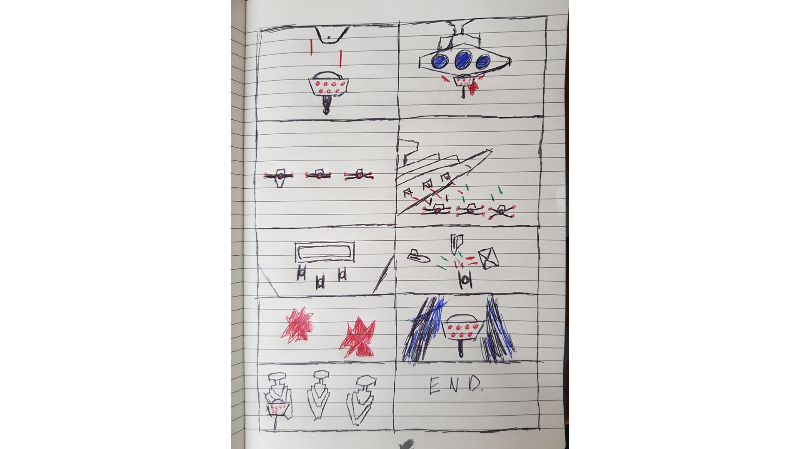

# AIProject

I hope to create a Star-Wars space battle which opens with the classic text crawl outlining what is happening in the Galaxy at the moment of the battle. Then it will be the shot of the star destroyer panning over head while firing at a ship. It will then lead into a large scale space battle with rebel ships and TIE fighters flying around in and out of formation, destroying eachother and attacking the larger ships. This all takes place in the large vast emptiness of space. The ship we saw at the start will jump to lightspace. When it arrives out of lightspace it will see three other star destroyers waiting for it. It will then end.

The result is something that is similar to what I described I was going to create. The scene plays out on its own without input. The rebel ship follows its path and the star destroyer follows it but remains on the same y point. The X-Wings approach the star destroyer and the camera switches accordingly. The TIEs then exit the hangar and follow their paths out, when they reach the end they break and chase the X-Wings. The turrets on the destroyer fire both at the rebel frigate and the X-Wings, finding new targets if they're out of range. Once enough time has passed the X-Wings are destroyed and the rebel frigate goes to warp. Arriving at the end only to find more destroyers waiting for him. The AI scripts are similar to what was provided but also have been edited to suit the various ships and behaviours that I wanted them to have. There are brains for the cameras, TIEs and X-Wings to control the the scenes. The music is from one of the star wars battlefront games but I thought it suited the video.
